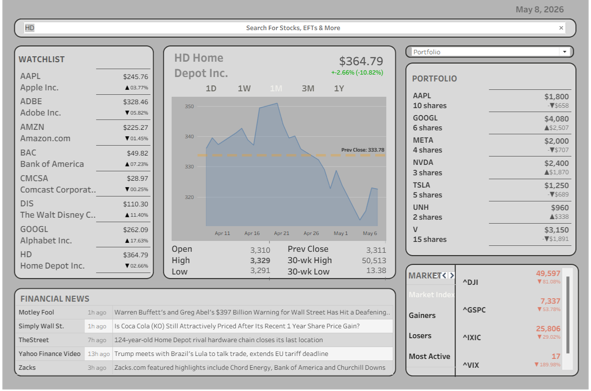

# 📈 Stock Market Dashboard
---

A professional dark-theme stock market dashboard 
tracking 20 major stocks across Tech, Finance, 
Healthcare and Consumer sectors.

Built with **Python** + **Tableau**.

---

## 🔴 Live Demo
👉 [View on Tableau Public](https://public.tableau.com/app/profile/taofeek.oladigbolu4026/viz/Book1_17760199982360/Dashboard1)

---

## 📊 Features

- **Watchlist** — 20 stocks with live price and % change
- **Price Chart** — Line chart with 30W High/Low and average line
- **Timeframe Selector** — 1D / 1W / 1M / 3M / 1Y
- **Market Trends** — Market Index, Gainers, Losers, Most Active
- **Portfolio & Alerts** — Holdings P&L and price alerts
- **Financial News** — Latest headlines from Yahoo Finance

---

## 🛠️ Tech Stack

| Tool | Purpose |
|---|---|
| Python | Data fetching & processing |
| yfinance | Stock price data |
| Pandas | Data transformation |
| Tableau | Dashboard & visualization |

---

## 🚀 How to Run

**1. Clone the repo**
git clone https://github.com/yourusername/stock-market-dashboard.git
cd stock-market-dashboard

**2. Install dependencies**
pip install -r requirements.txt

**3. Add your portfolio**
Edit data/portfolio.csv with your stocks:
symbol, shares, avg_buy_price, target_price, stop_loss
AAPL, 10, 150.00, 200.00, 130.00

**4. Run the script**
python scripts/fetch_stock_data.py

**5. Open Tableau**
Open dashboard/stock_dashboard.twbx
Refresh the data source

---

## 📁 Project Structure

stock-market-dashboard/
├── data/                  # Static data files
├── scripts/               # Python data pipeline
├── dashboard/             # Tableau workbook
├── screenshots/           # Dashboard preview images
├── requirements.txt       # Python dependencies
└── README.md              # Project documentation

---

## 👤 Author
Taofeek OLADIGBOLU
[LinkedIn](https://www.linkedin.com/in/taofeek-oladigbolu-12a417275/) · [Tableau Public](https://public.tableau.com/app/profile/taofeek.oladigbolu4026/vizzes)

---

## 📄 License
MIT License
